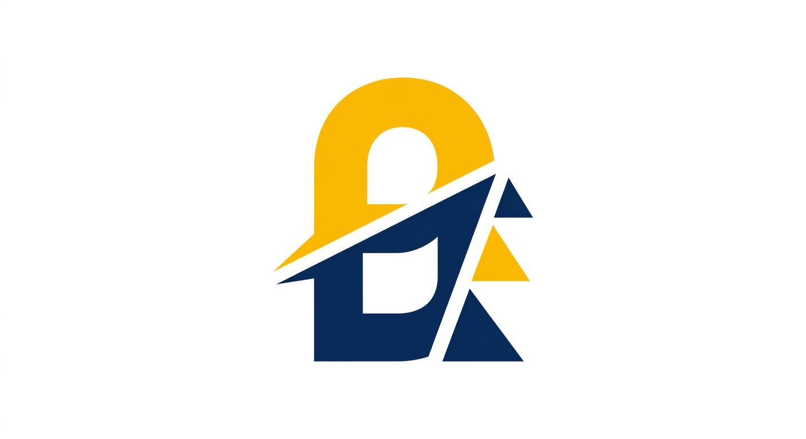

# Comment utiliser votre propre logo GOBEX

## Vous avez dit que vous allez uploader votre logo

### Étapes simples :

1. **Uploadez votre logo** dans la discussion (glisser-déposer)
   - Formats acceptés : PNG, JPG, SVG, WEBP
   - Idéalement fond transparent PNG

2. **Je le remplacerai automatiquement** à ces endroits :
   - `assets/img/logo.png` (logo principal)
   - `assets/img/logo-full.png` (version actuelle)
   - Header de toutes les pages
   - Footer (version blanche)

3. **En attendant**, le site utilise un logo temporaire généré :
   - Couleurs : Bleu nuit #0F2A44 + Or #F2A900 (charte pro)
   - Concept : G + flèche croissance

### Si vous avez déjà un fichier localement :

- Renommez votre fichier en `logo.png`
- Placez-le dans `assets/img/`
- Dans `index.html` ligne 33, changez :
  ```html
  
  ```

### Charte graphique détectée du logo temporaire :
- Primary: #0F2A44 (bleu nuit)
- Accent: #F2A900 (or)
- Ces couleurs sont utilisées dans tout le site (boutons, icônes, titres)

Dès que vous uploadez votre logo, je vais :
- Extraire sa charte graphique réelle
- Mettre à jour tout le site avec vos couleurs exactes
- Recréer les favicons

